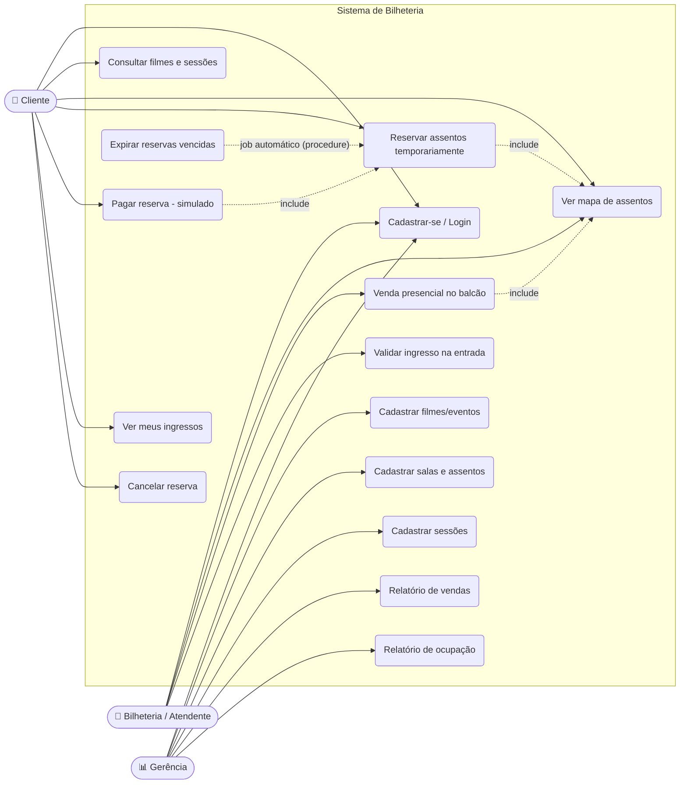

# Diagrama de Casos de Uso

```mermaid
flowchart LR
    C([👤 Cliente])
    B([🎫 Bilheteria / Atendente])
    G([📊 Gerência])

    subgraph Sistema de Bilheteria
      UC1(Cadastrar-se / Login)
      UC2(Consultar filmes e sessões)
      UC3(Ver mapa de assentos)
      UC4(Reservar assentos temporariamente)
      UC5(Pagar reserva - simulado)
      UC6(Ver meus ingressos)
      UC7(Cancelar reserva)
      UC8(Venda presencial no balcão)
      UC9(Validar ingresso na entrada)
      UC10(Cadastrar filmes/eventos)
      UC11(Cadastrar salas e assentos)
      UC12(Cadastrar sessões)
      UC13(Relatório de vendas)
      UC14(Relatório de ocupação)
      UC15(Expirar reservas vencidas)
    end

    C --> UC1 & UC2 & UC3 & UC4 & UC5 & UC6 & UC7
    B --> UC1 & UC3 & UC8 & UC9
    G --> UC1 & UC10 & UC11 & UC12 & UC13 & UC14
    UC4 -. include .-> UC3
    UC5 -. include .-> UC4
    UC8 -. include .-> UC3
    UC15 -. "job automático (procedure)" .-> UC4
```

> Bilheteria e Gerência usam o mesmo papel **OPERADOR** (permitido pelo enunciado).
